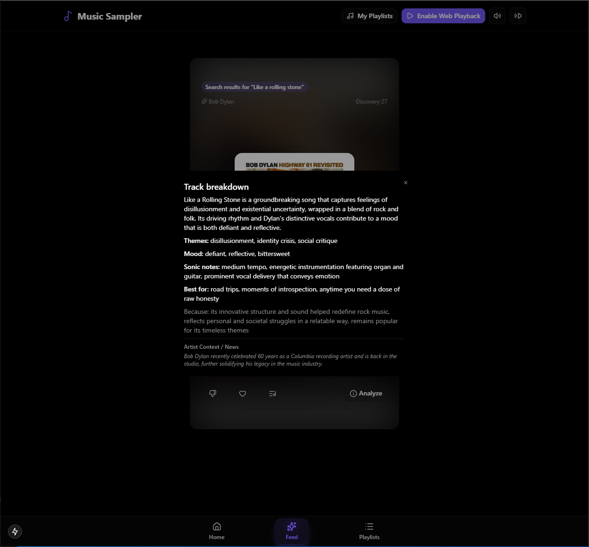
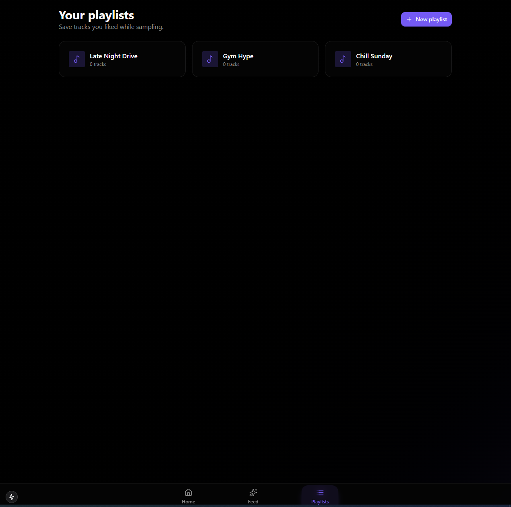
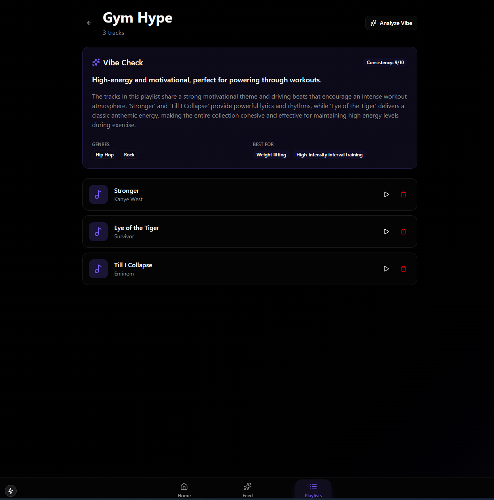

# Music Sampler and Discovery App

A modern AI-powered music discovery application that reimagines how users explore, curate, and analyze music. Sampler blends a TikTok-style vertical feed with deep LLM analysis and Spotify integration to create an immersive and intelligent music exploration experience.

---

## Motivation (Why?)

Music discovery today often feels passive. Streaming platforms recommend songs, but they rarely explain *why*. Listeners want context, emotion, and insight. They want to explore music the way they browse social media: fast, visual, and interactive.

**Sampler** fills this gap by:

1. **Visualizing Discovery**  
   A vertical, swipeable feed makes exploring new tracks feel intuitive and fun.

2. **Contextualizing Music**  
   AI-powered insights offer behind-the-lyrics explanations, artist context, and sonic breakdowns.

3. **Unifying Platforms**  
   Spotify integration makes discovery actionable. Save tracks or build playlists instantly.

---

## Preview

### Home Screen  


### Home Scroll  


### Feed Card Analysis  


### Playlist View  


### Playlist Analysis  


---

## Architecture and Tech Stack

Sampler is built as a modern, full-stack microservices-lite system designed for speed, scalability, and clean developer experience.

---

### Frontend (Client)

Built with **Next.js 15 (App Router)** and **React 19** for a smooth, app-like experience.

- **Styling**: Tailwind CSS v4  
- **State Management**:  
  - `zustand` for lightweight global UI state  
  - `@tanstack/react-query` for server state  
- **UI Components**: Radix UI primitives with a custom design system  
- **Media**:  
  - `react-youtube` for video previews  
  - Spotify Web Playback SDK for audio playback  

---

### Backend (Server)

A high-performance **FastAPI** service that orchestrates feed generation, playlist analysis, and AI workflows.

- **API Framework**: FastAPI (async)  
- **Database**: PostgreSQL with SQLAlchemy Async ORM  
- **Caching and Sessions**: Redis  
- **AI Engine**:  
  - OpenAI GPT-4o for track insights, playlist vibe analysis, lyric summaries  
  - Tavily Search for real-time context  

---

## Infrastructure

- **Containerization**: Docker and Docker Compose  
- **Database Migrations**: Alembic  
- **Environment Management**: `.env` files for API keys and credentials  

---

## Features

### Interactive Music Feed
- Swipe through track previews  
- Instant loading via prefetch and caching  
- Song metadata, visual elements, and integrated audio  

### AI-Powered Music Analysis
- **Track Explanations**: Understand themes, sonic details, artist background  
- **Playlist Vibe Check**: Summaries, use-cases, mood analysis  

### Spotify Integration
- Authenticate with your Spotify account  
- Save tracks  
- Create playlists  
- Manage playlist content directly from the app  

### Smart Playlists
- Automatically generate playlists based on mood, genre, or AI criteria  

---

## Getting Started

### Prerequisites

- Docker and Docker Compose  
- Node.js 20+ and pnpm  
- Python 3.11+  
- Spotify Developer Credentials  
- OpenAI and Tavily API keys  

---

### Installation

1.  **Clone the repository**
    ```bash
    git clone https://github.com/yourusername/sampler.git
    cd sampler
    ```

2.  **Environment Setup**
    -   Create a `.env` file in `backend/` based on `.env.example`.
    -   Fill in your API keys (Spotify, OpenAI, Tavily).

3.  **Launch Backend**
    ```bash
    cd backend
    docker-compose up -d
    # Or run locally:
    # pip install -r requirements.txt
    # uvicorn app.main:app --reload --port 8080
    ```

4.  **Launch Frontend**
    ```bash
    cd frontend/sampler-app
    pnpm install
    pnpm run dev
    ```

5.  **Explore**
    -   Open [http://localhost:3000](http://localhost:3000) to start discovering music.


